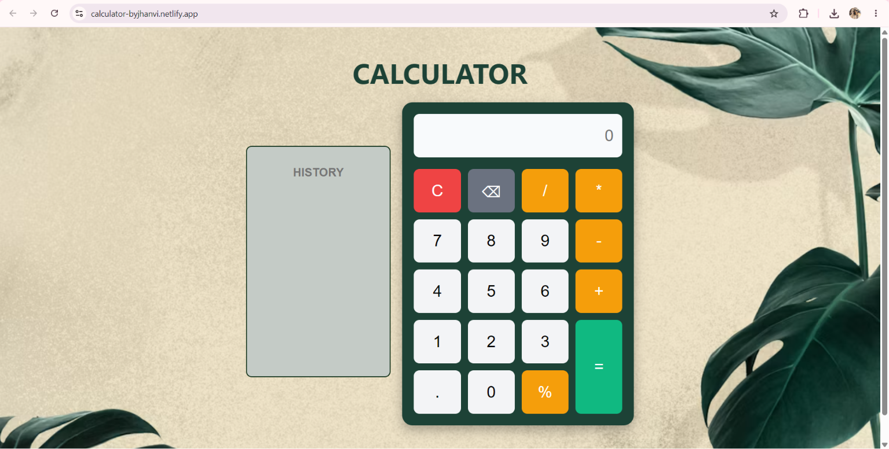
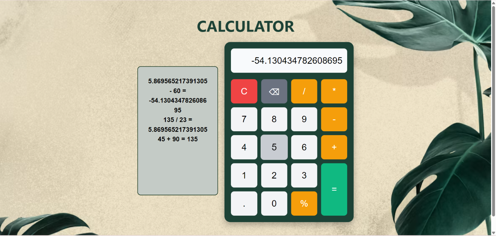
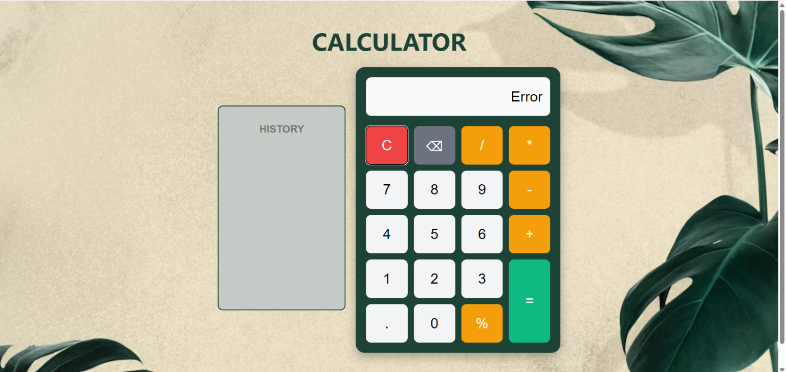

# Calculator – Web Calculator

A simple and responsive web calculator built using **HTML, CSS, and Vanilla JavaScript**. It performs basic arithmetic operations with a clean interface and includes a few additional features to improve usability.

This project was created as part of **Level 2 – Task 1** of the **Oasis Infobyte Web Development Internship**.

---

## 🔗 Project Links

**Live Demo:** [https://your-calculator-link.netlify.app](https://calculator-byjhanvi.netlify.app/)

**GitHub Repository:** [https://github.com/Jhanvi-code23/OIBSIP/tree/main/WebDev-L2-Task1-Calculator](https://github.com/Jhanvi-code23/OIBSIP/new/main/WebDev-L2-Calculator)

---

## 🚀 Features

- Responsive design
- Basic arithmetic operations (+, −, ×, ÷)
- Percentage (%) calculation
- Decimal number support
- Keyboard support
- Calculation history
- Backspace/Delete button
- Clear (C) button
- Division-by-zero error handling

---

## 🛠️ Technologies Used

- HTML5
- CSS3
- JavaScript (Vanilla)

---

## 📂 Project Structure

```
WebDev-L2-Task1-Calculator
│
├── index.html
├── style.css
├── script.js
├── README.md
└── screenshots/
```

---

## 📸 Screenshots

### Calculator



### History Panel



### Error Handling




---

## 📚 What I Learned

Working on this project helped me improve my understanding of:

- DOM manipulation
- Event handling using JavaScript
- CSS Grid layouts
- Responsive web design
- Handling keyboard events
- Managing application logic without using `eval()`

---

## ▶️ How to Run

1. Clone the repository.

```bash
git clone https://github.com/Jhanvi-code23/OIBSIP.git
```

2. Open the Calculator project folder.

```bash
cd OIBSIP/WebDev-L2-Task1-Calculator
```

3. Open `index.html` in your preferred web browser.

---

## 👩‍💻 Author

**Jhanvi Gupta**

GitHub: https://github.com/Jhanvi-code23
