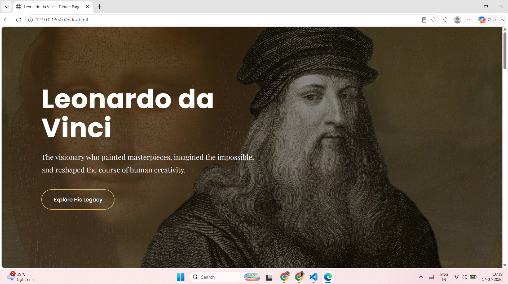
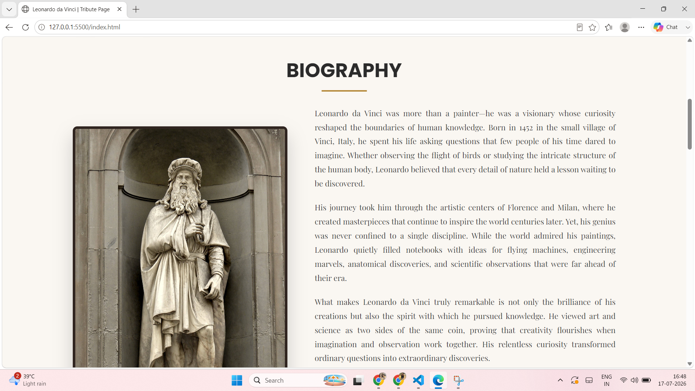
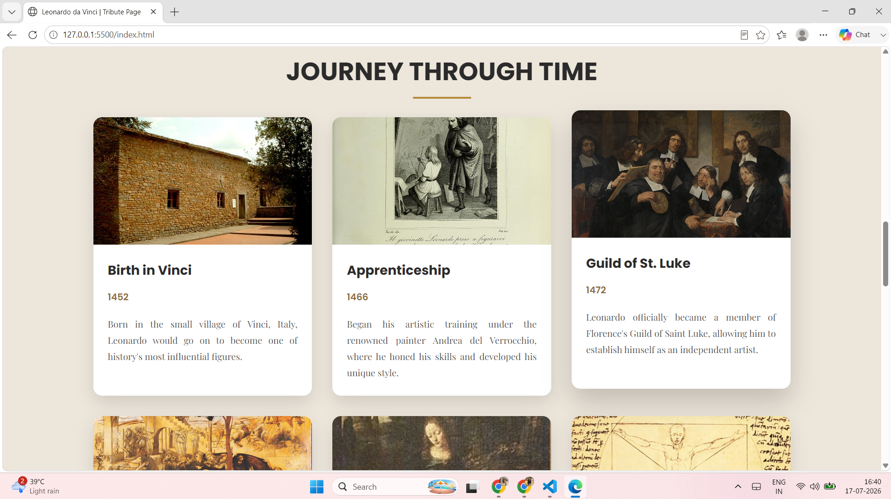
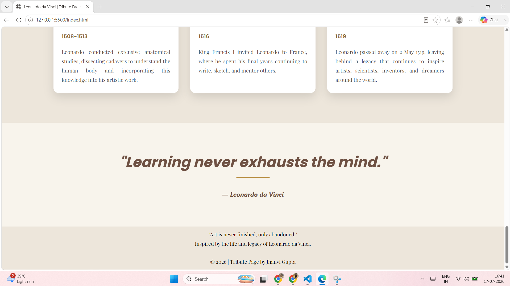

# Tribute Page – Leonardo da Vinci

A responsive tribute webpage dedicated to **Leonardo da Vinci**—one of history's greatest artists, inventors, and visionaries. The page highlights his life, achievements, and enduring legacy through a clean and engaging design.

This project was created as part of **Level 2 – Task 2** of the **Oasis Infobyte Web Development Internship**.

---

## 🌐 Live Demo

🔗 https://leonardodavincitribute.netlify.app/

---

## 🚀 Features

- Responsive and modern layout
- Hero section with an introduction
- Biography section
- Timeline of major milestones and achievements
- Inspirational quote section
- Clean and user-friendly interface

---

## 🛠️ Technologies Used

- HTML5
- CSS3
- Google Fonts
- Font Awesome

---

## 📂 Project Structure

```
WebDev-L2-Task2-TributePage
│
├── index.html
├── style.css
├── README.md
└── screenshots/
```

---

## 📸 Screenshots

### Home Page

  <br>

### Biography

  <br>

### Journey Through Time

  <br>

### Quote Section

  <br>

---

## 📚 What I Learned

Working on this project helped me improve my understanding of:

- Semantic HTML structure
- Responsive layouts using CSS
- Page organization and content presentation
- Typography, spacing, and visual hierarchy
- Creating a clean and engaging user interface

---

## ▶️ How to Run

1. Clone this repository.

```bash
git clone https://github.com/Jhanvi-code23/OIBSIP.git
```

2. Open the project folder.

3. Launch `index.html` in your preferred web browser.

---

## 👨‍🎨 About Leonardo da Vinci

Leonardo da Vinci (1452–1519) was an Italian Renaissance polymath whose work transformed the worlds of art, science, and engineering. Best known for masterpieces such as the *Mona Lisa* and *The Last Supper*, he also made remarkable contributions to anatomy, architecture, and invention. His curiosity and creativity continue to inspire generations around the world.

---

## 👩‍💻 Author

**Jhanvi Gupta**

GitHub: https://github.com/Jhanvi-code23

---

*Created as part of the Oasis Infobyte Web Development Internship.*
