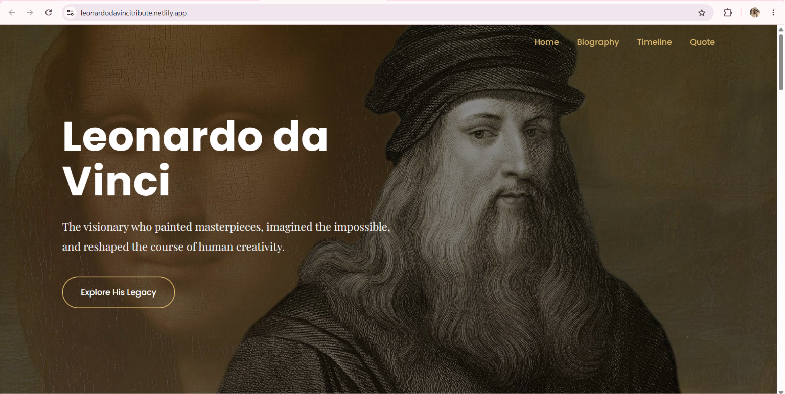
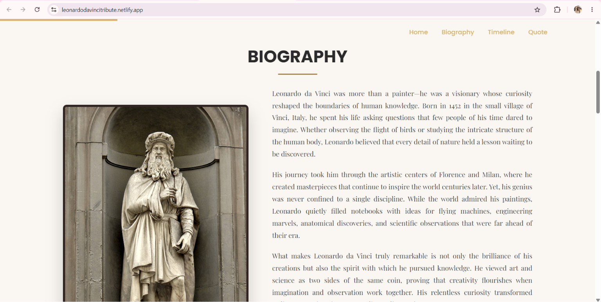
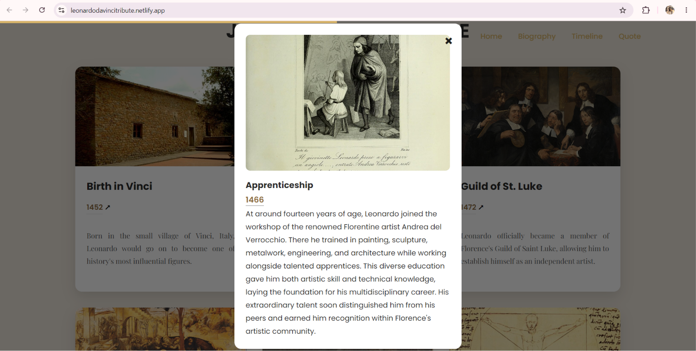
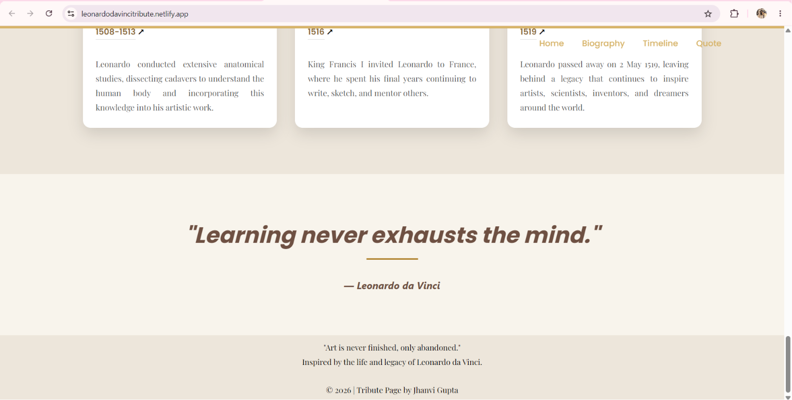

# Tribute Page – Leonardo da Vinci

A responsive tribute webpage dedicated to **Leonardo da Vinci**—the legendary Renaissance polymath whose contributions to art, science, engineering, and anatomy continue to inspire the world centuries later.

Built as part of **Level 2 – Task 2** of the **Oasis Infobyte Web Development Internship**, this project combines elegant design with interactive elements to create an engaging tribute experience.

---

## 🌐 Live Demo

🔗 **Visit Here:** https://leonardodavincitribute.netlify.app/

---

## 🚀 Features

- Fully responsive design for desktop, tablet, and mobile devices
- Full-screen hero section with immersive background image
- Fixed navigation bar with smooth scrolling
- Interactive biography section with elegant typography
- "Journey Through Time" timeline featuring 12 milestone cards
- Expandable pop-up cards displaying additional information and images
- Scroll progress indicator for enhanced navigation
- Inspirational quote section
- Hover animations and smooth transitions
- Clean and visually balanced user interface
---

## 🛠️ Technologies Used

- HTML5
- CSS3
- Vanilla JavaScript
- Google Fonts
- Font Awesome

---

## 📂 Project Structure

```text
WebDev-L2-TributePage
│
├── index.html
├── style.css
├── script.js
├── README.md
└── Screenshots/
```

---

## 📸 Screenshots

### Hero Section



### Biography Section



### Journey Through Time




### Quote



---

## 📚 What I Learned


Working on this project helped me strengthen my understanding of:

- Semantic HTML structure
- Responsive web design using CSS Media Queries
- CSS Flexbox and Grid layouts
- DOM manipulation with Vanilla JavaScript
- Creating interactive pop-up modals
- Event handling and user interactions
- Smooth scrolling and scroll progress indicators
- Typography, spacing, and visual hierarchy
- Designing clean and engaging user interfaces
---

## ▶️ How to Run

1. Clone this repository.

```bash
git clone https://github.com/Jhanvi-code23/OIBSIP.git
```

2. Navigate to the project folder.

3. Open `index.html` in your preferred web browser.

---

## 🎨 About Leonardo da Vinci

Leonardo da Vinci (1452–1519) was an Italian Renaissance polymath celebrated for his extraordinary achievements in painting, engineering, architecture, anatomy, and scientific research. His masterpieces, including the *Mona Lisa* and *The Last Supper*, transformed the world of art, while his notebooks revealed visionary ideas that were centuries ahead of their time. His relentless curiosity and innovative thinking continue to inspire artists, scientists, inventors, and dreamers across the globe.

---

## 👩‍💻 Author

**Jhanvi Gupta**

- GitHub: https://github.com/Jhanvi-code23
- LinkedIn: *(Add your LinkedIn profile here)*

---

> *"Learning never exhausts the mind."*  
> **— Leonardo da Vinci**

*Created as part of the Oasis Infobyte Web Development Internship.*
